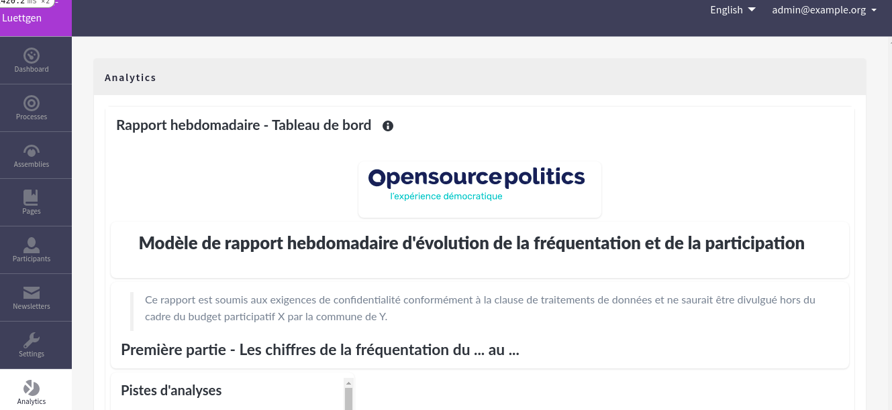
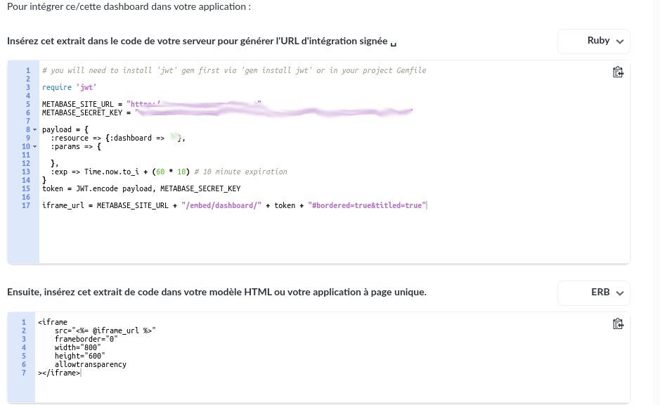

# Decidim::Metabase

This module adds a tab in the admin panel showing one Metabase dashboard of your choice



## Foreword
This module is a fork of the `decidim-module-analytics` made by Digidem Lab [here](https://github.com/digidemlab/decidim-module-analytics), so I strongly encourage you to take a look at it, as it does the same work but with a Metabase iframe instead of a Matomo one.
## Usage

You will of course need to have Metabase instance running on a server or the cloud version (untested).

The module doesn't have any settings panel as I don't want to write anything in the database. It will pick the data it needs from Rails secrets:

```yaml
metabase:
  enabled: true
  site_url: https://metabase.example.org
  secret_key: your_secret_key
  dashboard_id: 42
```

To complete with needed values, you simply need to visit your dashboard page in your Metabase instance, click on `Share` then `Integrate this dashboard in your application`. You'll fall in the following page after selecting `Ruby` as language wanted :


## Installation

1. Add this line to your application's Gemfile:

```ruby
gem "decidim-metabase", git: "https://github.com/OpenSourcePolitics/decidim-module-metabase"
```

And then execute:

```bash
bundle
```

2. Set the above secrets in your `config/secrets.yml`. I recommend using environment variables so the secrets should look something like that:

```yaml
metabase:
  enabled: <%= !ENV["METABASE_SITE_URL"].blank? %>
  site_url: <%= ENV["METABASE_SITE_URL"] %>
  secret_key: <%= ENV["METABASE_SECRET_KEY"] %>
  dashboard_id: <%= ENV["METABASE_DASHBOARD_ID"] %>
```

As descripted in [forewords](##Foreword), this module is heavily inspired by the [decidim-module-analytics](https://github.com/digidemlab/decidim-module-analytics) in which Digidem Lab recommend to set these variables dynamically through [this Ansible playbook](https://github.com/digidemlab/decidim-ansible/blob/master/roles/matomo/tasks/main.yml)

## Contributing

Create an issue or a PR if you want to suggest an improvement.

## License

This module is distributed under the GNU AFFERO GENERAL PUBLIC LICENSE.
